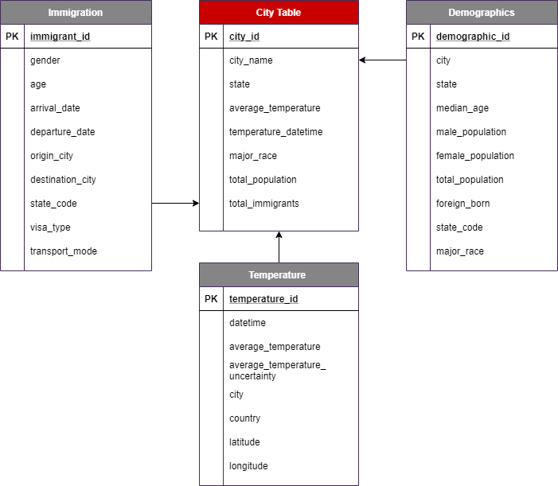
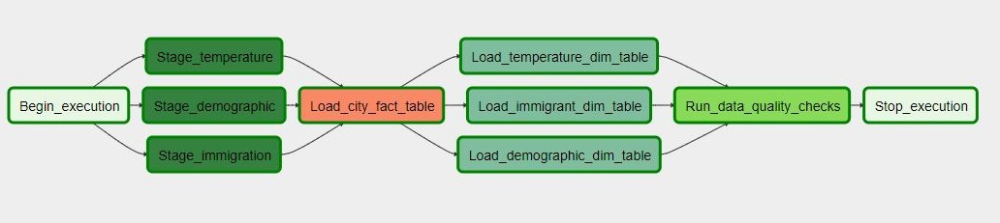
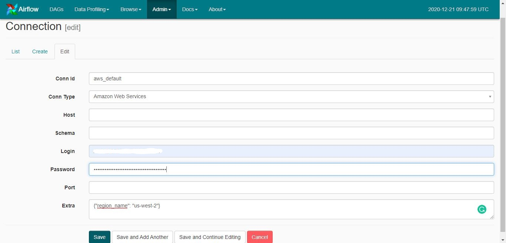
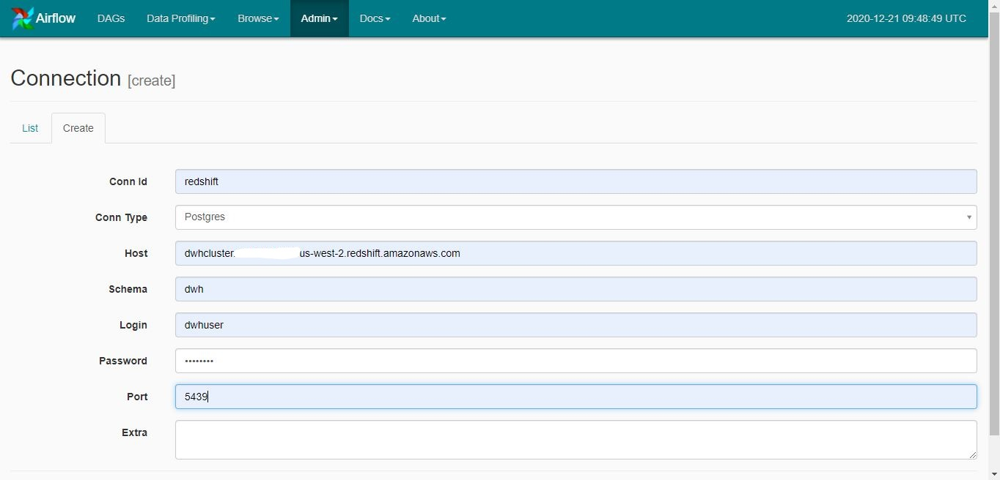

# Data Engineering Capstone Project

#### Project Summary
The project objective is to build an ETL pipeline to extract data from 3 different sources (I94 immigration, US city demographic, and World Temperature), cleaning and transform them using Spark and then load them into a Redshift data warehouse as analytics tables so it can be optimized to query.

#### Objective
The goal of the final analytics tables is to answer questions like the following:
* Which cities in the United States have the most immigrants?
* Where do most immigrants originate from?
* Does temperature, foreign-born population, or major race of a city affect the total number of immigrants?
* whats is the mode of transportation or the visa type that is mostly used by immigrants?

#### Project Steps 
1- Define the datasets that will be used and the data model.</br>
2- Build a script to process the data using Spark since I'm dealing with big data. The processing includes steps like removing duplicate records, removing unwanted columns, dropping records that have missing values, and transform data into a more readable format. After that, the script will save the resulted datasets in an S3 bucket.</br>
3- Write the SQL queries for creating and dropping the staging tables and the tables defined in the data model.</br>
4- Write the 'Insert Into Select' queries to copy data from the staged tables to the analytics tables.</br>
5- Create a Redshift cluster in AWS.</br>
6- Build a DAG in airflow to load data from S3 to Redshift and build the needed operators.</br>

#### Datasets 
* I94 Immigration Data: This data contains international visitor arrival statistics by world regions. It comes from the US National Tourism and Trade Office. [Source]("https://travel.trade.gov/research/reports/i94/historical/2016.html").</br>
* World Temperature Data: This dataset contains the dates and average temperature and much other information about the countries around the world. It comes from Kaggle. [Source]("https://www.kaggle.com/berkeleyearth/climate-change-earth-surface-temperature-data").   </br>
* U.S. City Demographic Data: This dataset contains information about the demographics of all US cities and census-designated places with a population greater or equal to 65,000. It comes from the US Census Bureau's 2015 American Community Survey. [Source]("https://public.opendatasoft.com/explore/dataset/us-cities-demographics/export/"). </br>

#### Technologies
* Apache Spark: Spark is used for its fast execution in processing big data. I used it to process the 3 datasets. </br>
* Amazon Redshift: Redshift is used as the data warehouse that holds the analytics tables of the project, I chose it since it offers fast query performance, cost efficiency, and easy scalability.</br>
* Apache Airflow: Airflow is used to schedule and monitor the project data pipeline.</br>
* Amazon Simple Storage Service (S3): used to store the datasets after processing.

#### Data Model

I used a star schema as the data model for this project. It consists of one fact table which is the City table, and it's referencing 3 dimensions tables which are demographic, temperature, and immigrants. I chose the star schema as it is simple and easy for end-users to understand, as well as for its good query performance since it has few tables and clear join paths.

#### Data Pipeline

#### Running Steps
1- Run the ```Prossing.py``` to process the datasets and upload them in the S3 bucket. </br>
2- Create a Redshift cluster in AWS by running the infrastructure as code file ```IaC.ipynb```. </br>
3- Run the ```Create_tables.py``` to create the tables in the database.</br>
4- Create the airflow connections aws_default and redshift.</br>
</br>
</br>

5- Run the ```Capstone_dag.py``` using the Airflow web UI.</br>
