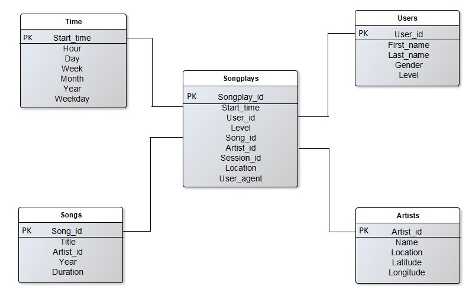

# Project: Data Modeling with Postgres


## Introduction
A startup called Sparkify wants to analyze the data they've been collecting on songs and user activity on their new music streaming app. The analytics team is particularly interested in understanding what songs users are listening to. Currently, they don't have an easy way to query their data, which resides in a directory of JSON logs on user activity on the app, as well as a directory with JSON metadata on the songs in their app.

## Objective

This project creates a Postgres database with tables to optimize queries on song play analysis, and build an ETL pipeline to retrieve the data stored in JSON files, then transfer it into the Postgres tables. Therefore, it will be easier for Sparkify to query their data and exploit it to know what songs users like to listen to and get other useful information.

## Dataset

### Song Dataset
The first dataset is the song dataset, which consists of many song files. Each file is in JSON format and contains metadata about a song and the artist of that song. The files are partitioned by the first three letters of each song's track ID. <br />
Below is an example of what a single song file, TRAABJL12903CDCF1A.json, looks like.
```json
{
    "num_songs": 1, 
     "artist_id": "ARJIE2Y1187B994AB7",
     "artist_latitude": null,
     "artist_longitude": null,
     "artist_location": "",
     "artist_name": "Line Renaud",
     "song_id": "SOUPIRU12A6D4FA1E1",
     "title": "Der Kleine Dompfaff",
     "duration": 152.92036,
     "year": 0
}
```
### Log Dataset

The second dataset consists of log files in JSON format. The log files in the dataset are partitioned by year and month. <br />
Below is an example of the data format in a log file.
```json
{
   "artist": "Barry Tuckwell/Academy of St Martin-in-the-Fields/Sir Neville Marriner",
   "auth": "Logged In",
   "firstName": "Mohammad",
   "gender": "M",
   "itemInSession": 0,
   "lastName": "Rodriguez",
   "length": 277.15872,
   "level": "paid",
   "location": "Sacramento--Roseville--Arden-Arcade, CA",
   "method": "PUT",
   "page": "NextSong",
   "registration": 1.54051176E12,
   "sessionId": 961,
   "song": "Horn Concerto No. 4 in E flat K495: II. Romance (Andante cantabile)",
   "status": 200,
   "ts": 1543279932796,
   "userAgent": "\"Mozilla/5.0 (Macintosh; Intel Mac OS X 10_9_4) AppleWebKit/537.36 (KHTML, like Gecko) Chrome/36.0.1985.143 Safari/537.36\"",
   "userId": "88"
}
```

## Database Schema
### Fact Table
1- songplays - records in log data associated with song plays i.e. records with page NextSong<br />
&nbsp;&nbsp;&nbsp;&nbsp;songplay_id, start_time, user_id, level, song_id, artist_id, session_id, location, user_agent

### Dimension Tables
1- users - users in the app<br />
&nbsp;&nbsp;&nbsp;&nbsp;user_id, first_name, last_name, gender, level<br />
2- songs - songs in music database<br />
&nbsp;&nbsp;&nbsp;&nbsp;song_id, title, artist_id, year, duration<br />
3- artists - artists in music database<br />
&nbsp;&nbsp;&nbsp;&nbsp;artist_id, name, location, latitude, longitude<br />
4- time - timestamps of records in songplays broken down into specific units<br />
&nbsp;&nbsp;&nbsp;&nbsp;start_time, hour, day, week, month, year, weekday<br />

### Schema Representation 


## Project Files
1- test.ipynb displays the first few rows of each table.<br />
2- create_tables.py drops and creates the tables.<br />
3- etl.ipynb reads and processes a single file from song_data and log_data and loads the data into the tables. This notebook contains detailed instructions on the ETL process for each of the tables.<br />
4- etl.py reads and processes files from song_data and log_data and loads them into the tables.<br />
5- sql_queries.py contains all the sql queries, and is imported into the last three files above.<br />
6- README.md provides a discussion about the project.

## Running Script
1- Run ```create_tables.py``` to create the database and tables. The script imports ```sql_queries.py``` which contains the create, drop and insert queries. <br />
2- Run ```etl.py``` to read and load the data into the tables.<br />
&nbsp;&nbsp;&nbsp;&nbsp;Note: before running the etl.py make sure to re-run the create_tables.py to reset the tables data.<br />
3- Run ```test.ipynb``` to verify data has been loaded into each table successfully.

### Reference 
- [Postgresql Documentation](https://www.postgresql.org/docs/13/index.html)
-  [Pandas Documentation](https://pandas.pydata.org/docs/user_guide/dsintro.html#dataframe)

