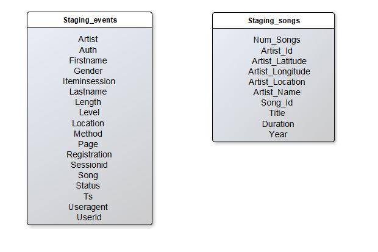
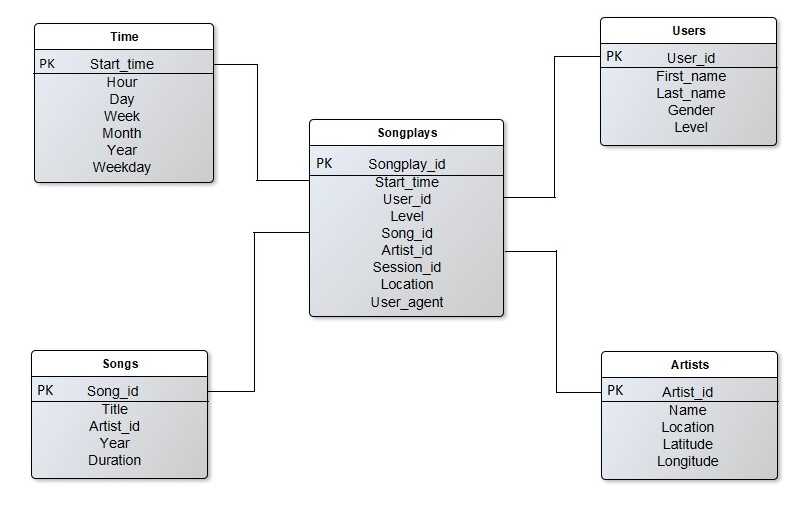

# Project: Data Warehouse with Redshift


## Introduction

A music streaming startup, Sparkify, has grown their user base and song database and want to move their processes and data onto the cloud. Their data resides in S3, in a directory of JSON logs on user activity on the app, as well as a directory with JSON metadata on the songs in their app.

## Objective

This project builds an ETL pipeline that extracts the data from S3, stages them in Redshift, and transforms data into a set of dimensional tables for the analytics team to continue finding insights in what songs their users are listening to.

## Dataset

### Song Dataset
The first dataset is the song dataset, which consists of many song files. Each file is in JSON format and contains metadata about a song and the artist of that song. The files are partitioned by the first three letters of each song's track ID. <br />
Below is an example of what a single song file, TRAABJL12903CDCF1A.json, looks like.
```json
{
    "num_songs": 1, 
     "artist_id": "ARJIE2Y1187B994AB7",
     "artist_latitude": null,
     "artist_longitude": null,
     "artist_location": "",
     "artist_name": "Line Renaud",
     "song_id": "SOUPIRU12A6D4FA1E1",
     "title": "Der Kleine Dompfaff",
     "duration": 152.92036,
     "year": 0
}
```
### Log Dataset

The second dataset consists of log files in JSON format. The log files in the dataset are partitioned by year and month. <br />
Below is an example of the data format in a log file.
```json
{
   "artist": "Barry Tuckwell/Academy of St Martin-in-the-Fields/Sir Neville Marriner",
   "auth": "Logged In",
   "firstName": "Mohammad",
   "gender": "M",
   "itemInSession": 0,
   "lastName": "Rodriguez",
   "length": 277.15872,
   "level": "paid",
   "location": "Sacramento--Roseville--Arden-Arcade, CA",
   "method": "PUT",
   "page": "NextSong",
   "registration": 1.54051176E12,
   "sessionId": 961,
   "song": "Horn Concerto No. 4 in E flat K495: II. Romance (Andante cantabile)",
   "status": 200,
   "ts": 1543279932796,
   "userAgent": "\"Mozilla/5.0 (Macintosh; Intel Mac OS X 10_9_4) AppleWebKit/537.36 (KHTML, like Gecko) Chrome/36.0.1985.143 Safari/537.36\"",
   "userId": "88"
}
```
## Staging Tables


## Analytics Tables
### Fact Table
1- songplays - records in log data associated with song plays i.e. records with page NextSong<br />
&nbsp;&nbsp;&nbsp;&nbsp;songplay_id, start_time, user_id, level, song_id, artist_id, session_id, location, user_agent

### Dimension Tables
1- users - users in the app<br />
&nbsp;&nbsp;&nbsp;&nbsp;user_id, first_name, last_name, gender, level<br />
2- songs - songs in music database<br />
&nbsp;&nbsp;&nbsp;&nbsp;song_id, title, artist_id, year, duration<br />
3- artists - artists in music database<br />
&nbsp;&nbsp;&nbsp;&nbsp;artist_id, name, location, latitude, longitude<br />
4- time - timestamps of records in songplays broken down into specific units<br />
&nbsp;&nbsp;&nbsp;&nbsp;start_time, hour, day, week, month, year, weekday<br />

### Schema Representation 


## Project Files
1- create_tables.py drops and creates the tables.<br />
2- sql_queries.py contains all the sql queries.<br />
3- IaC.ipynb setting up the needed infrastructure to launch the redshift cluster. <br />
4- etl.py loads log_data and song_data from S3 to staging tables on Redshift and then transforms them into the 5 analytics tables on Redshift.<br />
5- dwh.cfg contains the configuration information.<br />
6- README.md provides a discussion about the project.

## Running Script
1- Run ```create_tables.py``` to create the database and tables. <br />
2- Edit the ```dwh.cfg``` file with the your AWS access keys. <br />
3- Run ```IaC.ipynb``` to launch the cluster. <br />
4- Edit the ```dwh.cfg``` file with the your cluster information (IAM role ARN and cluster endpoint) <br />
5- Run ```etl.py``` to load the data from S3 to staging tables and then to the analytics tables on Redshift.<br />
